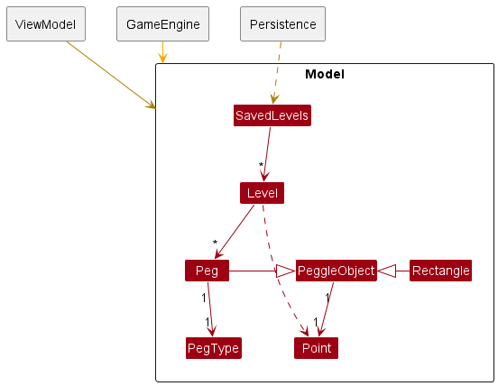
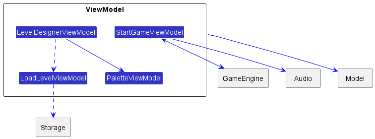
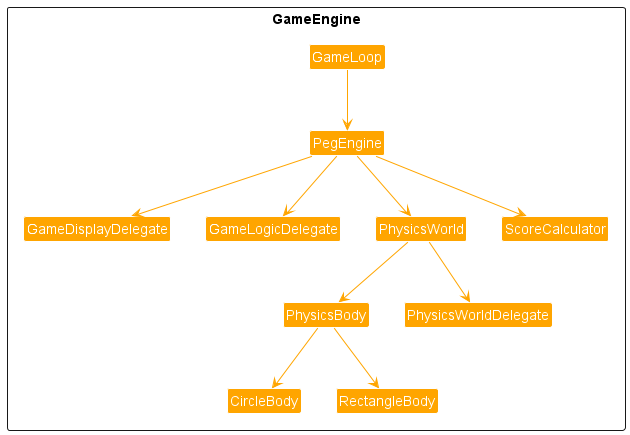
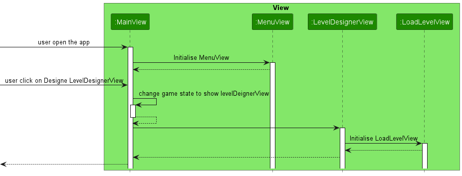

# Peggle for CS3217

**Name:** Zhang Weiqiang

**Matric No:** A0234629Y

## Rules of the Game

### General

In each level, there are pegs of various colours. 

The player starts with 10 cannon balls, and the objective of the game is to clear all orange pegs before the balls run out. If the balls all run out, the player loses the game.

### Cannon Direction

The game is played by shooting a ball to the arena. The player controls the cannon by dragging in the area; the cannon will point to the location of the drag. The player can then tap the screen to shoot the ball in that direction. The ball will then fall down, hitting some pegs. These pegs will light up once hit. Once the ball exits the screen, all lit pegs will disappear, and the player is allowed to shoot another ball if there are remaining pegs.

### Free Balls

There is only one way for player to get additional cannon ball. When the player gains free balls, the number of balls the player has is incremented. There is no maximum limit to the number of balls the player can achieve.

It is by catching the ball in the bucket. The bucket is positioned at the bottom of the arena, moving left and right. If the ball enters the bucket, the player is awarded one extra ball.

### Scoring System

#### Base Score

The base score of each peg is as follows:

- Blue peg: 10 points
- Green peg: 10 points
- Orange peg: 100 points

To calculate the base score of a shoot, sum up the points of each individual peg. For example, if a ball hits 10 blue pegs and 5 orange pegs, the total score is $10 \cdot 10 + 5 \cdot 100 = 600$.

#### Multipliers

This base score will be multiplied according to how many orange pegs remain:

- No orange pegs left: 100x
- 1 to 3 orange pegs left: 10x
- 4 to 7 orange pegs left: 5x
- 8 to 10 orange pegs left: 3x
- 11 to 15 orange pegs left: 2x
- At least 16 orange pegs left: 1x

The multiplier affects the individual peg scores. For example, suppose the player has a 2x multiplier. The points gained from the base score will be multiplied by 2.

### Win and Lose Conditions

The game consists of 3 game modes:

### Beat the Score!

When player chooses this mode, a target score will be automatically calculated based on the number and types of the pegs present in the game. The timer for the game will also be updated automatically based on some simple algorithms. In this game mode, the player wins the game only if he/she could hit the target score within the time limit.

### Siam Left, Siam Right! 

When player chooses this mode, a target number $N$ will be automatically calculated based on the number and types of the pegs present in the game. The timer will counts from 100 seconds. In this game mode, the player wins the game only if he/she could shoot $N$ balls without hitting any pegs. (Hitting rectangular blocks is fine)

### Normal

When player does not choose a mode, the default normal game mode will be chosen. The timer will counts from 100 seconds. The player wins the game only if he/she could clear all the orange pegs before times up or cannon ball being used up.

## Game Features (UI)

### Menu

There are two options in the menu, the player could choose to tap on Design Level to enter level designer or tap Start Game to start the game.

### Level Designer

#### Loading

When tapping on design level, this view will show up. The player could choose which level to load into Level Designer to edit, or player could tap on New Level to edit on an empty Level. The player could go back to the menu view by clicking on the red cancel sign on the top.

> The default levels will not be allowed to modify, if the player tries to change the default levels,  new level will be created instead.

#### Level Designer

The level designer consists of 3 main components: Canvas, palette row and footer row.

The palette row consists of:

+ Blue peg
+ Orange peg
+ Spooky peg: When hitted, the cannon ball will be able to ignore the top and bottom screen bound for once.
+ KaBoom peg: This peg will explode when hitted.
+ Rectangular block
+ Resize button
+ Erase button

When any of the button in the palette row being clicked, the button will light up to notify player that this button is selected.

#### Placing Peg/Rectangular Block

If the player selects the circles and rectangles on the palette row, the player could then tap on the canvas to place circles/rectangle on the tapped location.

Example:

 

#### Move Peg/Rectangular Block

If there are pegs/rectangular block being place on canvas, the player could drag them to move them to other positions.

#### Remove Peg/Rectangular Block

1. If the player selects last button on the palette row, the player could remove peg/rectangular block on canvas by tapping on them.
2. The player could also peg/rectangular block on canvas by long pressing on them.

#### Peg Resizing

If the player selects second last button on the palette row, the player could then resize the peg/rectangular block on canvas by dragging them.

> Note that there are minimum size and maximum size for both peg/rectangular block.

#### Reset

The player could tap on the reset button on the footer row to empty the canvas.

#### Load

The player could tap on the load button to show the loading page.

#### **Save**

The player could tap on the save button to save the level that he/she has created.

#### Start

The player could tap on start button to start the game using the level that he/she has created.

> Note that if player taps on start without tapping on save first, after finish playing the game, the created level will be lost.

## Start Game

### Loading

When tapping on start game from menu, this view will show up. The player could choose which level to load into Start Game to play. The player could go back to the menu view by clicking on the red cancel sign on the top.

### Select Game Mode

After selecting the level, the player will be asked to select the game mode, if the player taps on Cancel, the default game mode Normal will be chosen.

#### Start Game "Beat the Score!"

If the player selects Beat the Score mode, there will be additional target point being displayed on the bottom left of the screen.

#### Start Game "Siam Left, Siam Right!"

If the player selects Siam Left, Siam Right mode, there will be additional information displayed on the bottom left of the screen.

#### Start Game "Normal"

If the player selects Cancel, this view will show up.

#### Rotate Cannon

The player could rotate cannon by dragging on the screen.

#### Fire Cannon

The player could shooting the cannon ball by tapping the screen, and the cannon ball will be shoot from the direction where the cannon is pointing at.

## Dev Guide
This application is built using SwiftUI, following the MVVM model. The image below shows the overall architecture of my application.

The detailed version of the architecture diagram:

### Model

My model consists of `PeggleObject` class, which encapsulates the information of the positions of all the game objects. 

`Peg` class, modelling the behaviour and the type of the pegs on the screens. 

`Rectangle` class, encapsulating the rectangular blocks in the game.

`Level` class, which stores an array of `Peg` and the String `levelName`. 

`SavedLevels` contains an array of levels that are to be stored to or loaded from the storage file.

### View

There four groups of views `LevelDesignerView`, `startGameView`, `MainView` and `MenuView`.

#### `LevelDesignerView`

This view is responsible for displaying the level designer of the Peggle game, it consists of:

`DesignerCanvasView` displays the `PegView` on the level designer canvas.

`PaletteView` displays a group of `PaletteButtonView`.

`FooterView` displays the bottom row of the level designer.

`LoadLevelView` shows the loading page of different levels, it is only displayed when the user wants to load a certain level.

`AddedPegsView` shows the information of the pegs present on the canvas.

#### `StartGameView`

This view is responsible for displaying the main playing state of the game, it consist of:

`StartGameCanvasView` displays the main game canvas of the game.

`StartGameLoadingView` shows the loading page of different levels, it is only displayed when the user wants to load a certain level.

`PointsView` which displays the cumulative points that the player has earned.

`TimerView` displays the count down timer.

`RemainingPegsView` shows the information of the remaining pegs on canvas.

`CannonBallCountView` shows the information of the remaining cannons on canvas.

#### `MainView`
This view is the main displaying view of the game, depending on the game state, the main view will switch between the `MenuView` and the `LevelDesignerView`.

#### `MenuView`
This view displays the game menu, the user can select "Start game"(has not been implemented yet) or "Design level" to navigate to the `LevelDesignerView`.

### ViewModel

`PaletteViewModel` is responsible for keeping track of the currently selected button in the `PaletteView`.

`LoadLevelViewModel` is storing the saved levels for `LoadLevelView` to use.

`LevelDesignerViewModel` is responsible for all the different gestures logic of the game objects on the level designer canvas.

`StartGameViewModel` is responsible for the logic of the game, it runs the game by communicating with `GameEngine`, `Model` and `Audio`.

### GameEngine

#### GameLoop

It is responsible for:

1. Updating the game state: The `update` method is called at a specified number of frames per second and updates the game engine by calling its `update` method and passing in the elapsed time.
2. Rendering the game graphics: The `render` method of the game engine is called after the game state is updated to display the updated state of the game.
3. Coordinating the timing of the game loop with the display refresh rate: The `CADisplayLink` class is used to coordinate the timing of the game loop with the display refresh rate, ensuring that the game runs smoothly and in sync with the display.

#### PegEngine

The `PegEngine` class is responsible for managing and coordinating all the components of the game engine. It integrates the game loop, physics world, and game display and logic delegates to provide a seamless experience for the player. The class has the following responsibilities:

1. Game loop management: The `PegEngine` class manages the `GameLoop` object and starts the game loop when necessary.
2. Physics world management: The class manages the `PhysicsWorld` object and adds physics bodies to it.
3. Mapping of game objects to physics bodies: The `PegEngine` class maintains a mapping of game objects (`PeggleObject`) to their corresponding physics bodies. This mapping is used to keep track of the position of game objects and update the display accordingly.
4. Cannon ball firing: The class implements the logic for firing cannon balls by creating a physics body for the cannon ball and adding it to the physics world.
5. Display management: The `PegEngine` class delegates updates to the display delegate and provides methods for setting the display delegate.
6. Logic management: The class delegates game logic updates to the logic delegate and provides methods for setting the logic delegate.
7. Object destruction management: The class implements logic for destroying objects that have gone out of bounds or have collided with other objects.
8. Update the score using the `ScoreCalculator` class.

#### PhysicsWorld

The `PhysicsWorld` class is responsible for simulating the physics of bodies in a world. Some of the key responsibilities of this class are:

1. Managing a list of `physicsBody`: The class maintains an array of `PhysicsBody` objects that exist in the world.
2. Simulating physics: The `simulatePhysics` method simulates the physics of the bodies in the world over a certain time interval. The method performs several tasks, such as simulating gravity, generating new positions for the bodies, resolving collisions between bodies, and removing bodies that are destroyed or out of bounds.
3. Adding bodies to the world: The `addPhyBody` method allows adding new bodies to the world.

## Key Flows

### Flow when the user start the game

### Flow when the user drags a peg

### Flow of how PhysicsWorld simulate Physics

## Tests
### Unit Test

+ `Peg.swift`
  + `init(radius: Double, pegType: PegType, coordinate: Point = .ZERO)` method
    + When passed with a double for radius, it should initialise the property radius to the value.
    + When passed with a PegType.bluePeg for pegType, it should initialise the property pegType to bluePeg.
    + When passed with a PegType.orangePeg for pegType, it should initialise the property pegType to orangePeg.
    + When passed with a Point for coordinate, it should initialise the property coordinate to that point.
    + When passed with no Point for coordinate, it should initialise the property coordinate to (0,0).
  + `init(pegType: PegType, coordinate: Point = .ZERO)` method
    + + When passed with no double for radius, it should initialise the property radius to 30.0.
  + getDeepCopy() method
    + When called, it should return the exact copy of the given Peg.
  + `restoreState(from peggleObj: PeggleObject)` method
    + When passed with a PeggleObject, if that PeggleObject can be cast to Peg, the caller Peg will copy all the property value from that Peg.
  + `isOverlaping(peg: Peg)` method
    + When passed with a Peg, it should return true if the Peg is overlapping with it, and return false otherwise.
  + `isFullyAbove(yCoordinate: Double)` method
    + When passed with a double representing the yCoordinate, it should return true if the coordinate of the point lies above the yCoordinate, and false otherwise.
  + `isFullyBelow(yCoordinate: Double)` method
    + When passed with a double representing the yCoordinate, it should return true if the coordinate of the point lies below the yCoordinate, and false otherwise.
  + `isFullyRight(xCoordinate: Double)` method
    + When passed with a double representing the xCoordinate, it should return true if the coordinate of the point lies right to the xCoordinate, and false otherwise.
  + `isFullyLeft(xCoordinate: Double)` method
    + When passed with a double representing the xCoordinate, it should return true if the coordinate of the point lies left to the xCoordinate, and false otherwise.
+ `PeggleObject.swift` 
  + `init(coordinate: Point = .ZERO)` method
    + When passed with a Point for coordinate, it should initialise the property coordinate to that point.
    + When passed with no Point for coordinate, it should initialise the property coordinate to (0,0).
  + `moveTo(coordinate: Point)` method
    + When passed with a Point for coordinate, it should reassign the value for self.coordinate to that coordinate
+ `Level.swift` 
  + `init(levelName: String = "", pegs: [Peg] = [Peg]())` method
    + When passed with a String for levelName, it should initialise the levelName property to that string value.
    + When passed with no String for levelName, it should initialise the levelName property to empty string.
    + When passed with a Peg array for pegs, it should initialise the pegs property to that Peg array.
    + When passed with no Peg array for pegs, it should initialise the pegs property to the empty Peg array.
  + `getPegs()` method
    + When called, it should return the stored peg array.
  + `addPeg(_ peg: Peg)` method
    + When passed with a Peg, it should add that Peg to the stored Peg array.
  + `removePeg(_ peg: Peg)` method
    + When passed with a Peg, if the stored Peg array contains that Peg, that Peg should be removed from the array.
  + `moveSelectedPegTo(coordinate: Point, _ selectedPeg: Peg)` method
    + When passed with a Peg and a Point, it should move that Peg to the Point.
  + `copy(level: Level)` method
    + When passed with a Level, it should replace the stored levelName and peg array to the level name peg array of the passed in Level.
+ `SavedLevels.swift` 
  + `init(levels: [Level] = Storage.retrieveSavedLevels())` method
    + When passed with a Level array, it should initialise the levels property to the Level array.
    + When passed with no Level array, it should initialise the levels property by calling `Storage.retrieveSavedLevels()`
  + `append(level: Level)` method
    + When passed with a Level, it should append the level to the level array.
  + `contains(level: Level)` method
    + When passed with a level, it would return true if the level array contains that level, and false otherwise.
  + `copySelectedLevel(_ template: Level)` method
    + When passed with a level, if that level is in the level array, it should replace that level in the array with the passed in level.
+ `PaletteViewModel.swift`
  + `init(_ selectedButton: PaletteViewModel.SelectedButton = SelectedButton.none)` method
    + When passed with a PaletteViewModel.SelectedButton, it should initialise the selectedButton to that button.
    + When passed with no PaletteViewModel.SelectedButton, it should initialise the selectedButton to SelectedButton.none.
  + `select(button: PaletteViewModel.SelectedButton)` method
    + When passed with a PaletteViewModel.SelectedButton, if the current selected button is that button, it should unselect the current selected button, otherwise it should select that button.
  + `unselectButton()` method
    + When called, it should set the current selected button to SelectedButton.none.
+ `LoadLevelViewModel.swift`
  + `init(savedLevels: SavedLevels = .init())` method
    + When passed with a SavedLevels, it should initialise the savedLevels property to that value.
    + When passed with no SavedLevels, it should initialise the savedLevels property by calling the init() method of SavedLevels.
  + `getLevelCollection()` method
    + When called, it should return the Level array stored.
+ `LevelDesignerViewModel.swift`
  + `init(paletteViewModel: PaletteViewModel = .init(), selectedLevel: Level = .init())` method
    + When passed with a PaletteViewModel, it should initialise the paletteViewModel property to that value.
    + When passed with a PaletteViewModel, it should initialise the paletteViewModel property by calling the init() method of PaletteViewModel
    + When passed with Level, it should initialise the selectedLevel property to that Level.
    + When passed with no Level, it should initialise the selectedLevel property by calling the init() method of Level class.
  + `isValidState(peg: Peg, canvas: CGRect)` method
    + When passed with a Peg, and a CGRect, it should return true if the Peg is within the canvas and no other pegs are intersecting with it on the canvas, otherwise return false.
  + `setLevel(_ level: Level)` method
    + When passed with a Level, it should set the current selectedLevel to that level.
  + `createNewLevel()` method
    + When called, it should set the selectedLevel by calling the .init() method of Level.
  
+ `Vector.swift`
  + Testing `magnitude()`:
    - Given: a vector (1, 1)
    - When: magnitude() is called
    - Then: the result should be sqrt(2)
  + Testing `add(to:)`:
    - Given: two vectors (1, 1) and (2, 2)
    - When: add(to:) is called with the second vector as argument
    - Then: the result should be (3, 3)
  + Testing `subtract(_:)`:
    - Given: two vectors (1, 1) and (2, 2)
    - When: subtract(_:) is called with the second vector as argument
    - Then: the result should be (-1, -1)
  + Testing `scalarMultiply(with:)`:
    - Given: a vector (1, 1) and scalar 2
    - When: scalarMultiply(with:) is called with the scalar as argument
    - Then: the result should be (2, 2)
  + Testing `normalized()`:
    - Given: a vector (3, 4)
    - When: normalized() is called
    - Then: the result should be a vector with magnitude of 1, approximately (0.6, 0.8)
  + Testing `dotProduct(with:)`:
    - Given: two vectors (1, 2) and (3, 4)
    - When: dotProduct(with:) is called with the second vector as argument
    - Then: the result should be 11
  + Testing `angle(with:)`:
    - Given: two vectors (1, 0) and (0, 1)
    - When: angle(with:) is called with the second vector as argument
    - Then: the result should be pi / 2
### Integration Test

+ Test PaletteView
  + When blue peg is selected, the selected button in PaletteViewModel should switch to bluePeg.
  + When orange peg is selected, the selected button in PaletteViewModel should switch to orangePeg.
  + When delete is selected, the selected button in PaletteViewModel should switch to delete.
+ Test DesignerCanvasView
  + When blue peg is selected, and the user tap on a empty position on the screen, a blue peg should appear center at that empty position.
  + When orange peg is selected, and the user tap on a empty position on the screen, a orange peg should appear center at that empty position.
  + When delete is selected, and the user tap on a peg on the screen, that peg should disappear.
  + When long pressed a peg for 0.5s, the peg should disappear.
  + When dragging a peg, that peg should move according to the drag motion.
  + Dragging a peg to the edge of the screen should stop at the edge.
  + Dragging a peg through another peg should not overlap the two pegs.
  +  After saving level X, re-loading it should show the correct level.
  +  When the resize button is selected, the user should be able to resize the peg by dragging it.
  +  When the resize button is selected, if the peg size is being reduced to a limit, the peg should maintain a minimum size.
  +  When the resize button is selected, if the peg size is being enlarged to a limit, the peg should maintain a maximum size.
  +  If the resized peg will hit other pegs or the screen, the player should not be able to continue resizing the peg.
+ Test FooterView
  + When tap on load, a LoadLevelView should appear.
  + When tap on save, the current level should be saved in the data.json file.
  + Saving with name X should yield a saved level with name X.
  + Saving with empty should yield a saved level with Unnamed Level
  + When modifying level name, the levelName property for the selectedLevel in the LevelDesignerViewModel should change accordingly.
+ Test LoadLevelView
  + When tap on cross, the MenuView should appear.
  + When tap on "+ New Level", the LevelDesignerView should appear with empty levelName and canvas.
  + When tap on a level, the respective level should be shown on the LevelDesignerView
+ Test StartGameCanvasView
  + When user is dragging the screen, the cannon should rotate to the dragged position.
  + Cannon should not point anywhere else other than in the direction of the user’s finger
  + Dragging to positions above the cannon should cause cannon to face upwards.
  + When tapped, a cannon ball should be fired at the direction when the cannon is pointing at.
  + The bucket should be moving horizontally, when collide with the screen, the bucket should continue moving at opposite direction.
  + When cannon ball is being shoot, it should be moving downwards.
  + When collide with pegs, cannon ball will bounce, the pegs should light up.
  + When cannon ball is being fired, user should not be able to fire another cannon ball.
  + When cannon ball is out of the screen, all lighted up pegs should be removed.
  + When the cannon ball exits the screen, all non lighted up pegs should not be removed from the screen
  + When cannon ball hits the horizontal edge, it should bounce back.
  + When cannon ball hits the vertical edge, it should continue to pass through.
  + When cannon ball exits the screen from top, it should be removed.
  + When cannon ball hits the rectangular block, it should bounce.
  + When cannon ball hits the bucket, it should be removed.
  + When cannon ball hits the bucket, the cannon ball count should increase.
  + When cannon ball hits KaBoom ball, the KaBoom ball should explode with animation and apply huge pushing force on cannon ball, the other pegs within the explosion radius should light up.
  + When the KaBoom Ball lights up by the explosion of another KaBoom ball, it should explode with animation, the other pegs within the explosion radius should also light up.
  + After the KaBoom Ball exploded and lights up, when the cannon ball hits it again, it should not explode.
  + When cannon ball hits spooky ball, after the cannon ball exits the screen from bottom, it should appear at the relative same position from the top of the screen.
  + When cannon ball hits spooky ball, after the cannon ball exits the screen from top, it should appear at the relative same position from the top of the screen.
  + After the spooky ball being light up, when the cannon ball hits it again, the cannon ball should not be able to ignore the bound.
  + When the timer is up, a prompt text should be shown.
  + When the player wins the game, a prompt text should be shown.
  + When the player lost the game, a prompt text should be shown.
  + When the player selects the "Beat the Score!" game mode, the target score should be calculated and display at the bottom left of the screen.
  + When the player selects the "Beat the Score!" game mode, the timer should be updated.
  + When the player selects the "Siam Left, Siam Right!" game mode, the number of balls that the player need to "Siam" should be calculated and displayed at the bottom left of the screen.
